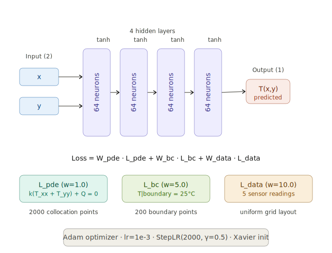

## AI-TDP

This project is for portably **predict** and **visualize** the thermal distribution on chips by light-weight AI, without relying on sensors heavily, which are both inconvenient and costly.

Nowadays, thermal management and monitor of circuit boards are in increasing challenge. Relying heavily on sensors to detect whole heat distribution becomes more and more trivial, especially for larger server clusters or computing centers being blowing up.

AI-TDP is born for it.

### Aims

1. Take inputs of several sensors on a specific chip and then predict its whole thermal distribution based on time-streamed changes of input.
2. Take input of an arbitrary chip photo, based on environment temperature and internal current, predict a series of anime representing thermal distribution change both in dimensions of time and current intensity.
3. Make comparisons among PINN, other notable nerual networks and the real sensor detection data, showing accuracy regardless of convenience.

### Demo

Now the first demo is in `chip_thermal_pinn.py`, which basically construct a MLP, as illustrated below.



- Activation function: `Tanh` as opposed to `ReLU` because PINN needs second derivative.
- Three kinds of `Loss`. The PDE residual calculates the deviation of the physical equation at 2000 randomly scattered collocation points; BC constrains T=25°C at 200 boundary points; and Data constrains the measured temperature values at 5 sensor locations.

This is for a quick feasibility check, so the architecture is quite simple and the training data is generated by code in effect.

### Usage

```bash
# uv (Recommended)
uv init
uv add pytorch numpy matplotlib
uv run chip_thermal_pinn.py
```