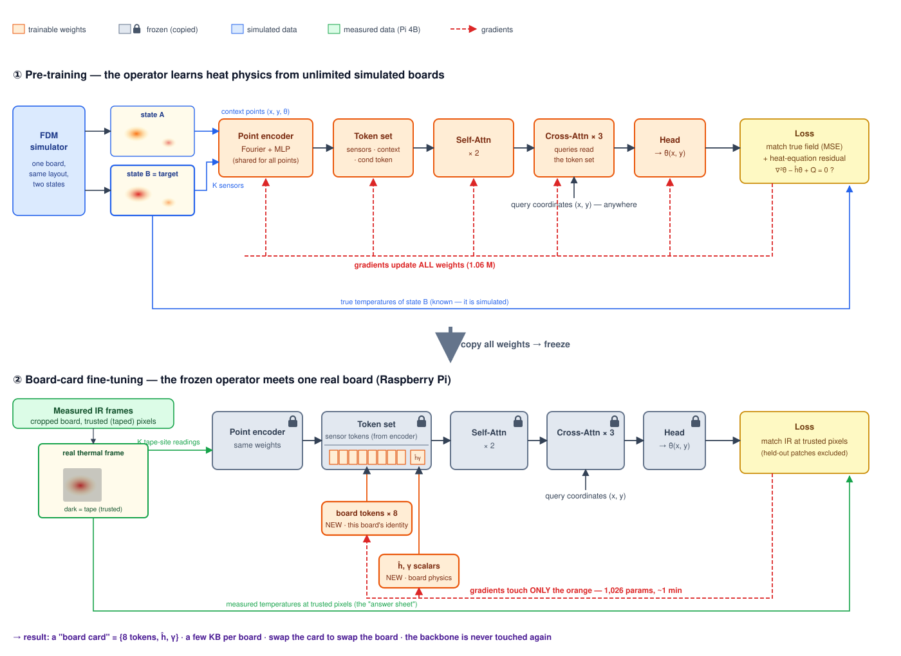

# TDP — Thermal-field reconstruction from sparse trusted sensors

**A physics-pretrained attention operator reconstructs a board's full temperature
field from a few trusted point sensors; each new board is adopted with a 5.8 KB
"board card" (1,026 parameters, one minute) — toward on-device thermal
self-monitoring.**



## Why

Dense, accurate temperature maps drive dynamic thermal management — but each
available instrument delivers only half:

- **IR thermography** is dense but *lies where emissivity is low*. Measured on
  our own board: the same connector shields at the same load read **31 °C bare
  vs 45 °C taped — a +14 °C artifact from ε alone**. And a closed server offers
  no optical access anyway.
- **Contact / on-die sensors** are accurate but sparse (a handful per board).

TDP reconstructs the dense field from K sparse trusted points. This is the
TFR-HSS problem class ([arXiv:2108.08298](https://arxiv.org/abs/2108.08298));
the full Chinese competition narrative lives in `docs/story_zh.md`.

## Headline results (all regenerable from `scripts/`)

| Evaluation (trusted-pixel RMSE) | ours | RBF interpolation |
|---|---|---|
| Zero-shot, no training on this board (8 real sites + 1 reference frame) | 3.3–3.5 °C | 4.0–5.7 °C |
| After the 5.8 KB board card — **untouched** full-load test (case02) | **3.08 °C** | 5.39 °C |
| Same card, **cross-session** full load (re-staged camera, 180° mount, new resolution) | **3.18 °C** | 5.38 °C |

Supporting measurements: on-die diode vs IR-on-tape agree within **1.0 °C**
(independent-instrument validation); the SoC spends **36% of its full-load
plateau ≥ 80 °C** (soft-throttle active — the "severe condition" is the thermal
design limit); cooling is two-mode (τ ≈ 140 s package / 251 s PCB) toward the
idle-powered equilibrium θ∞ ≈ 13 °C; measured ĥ bound ≲ 3 configured the
simulator and the fitted card agrees (ĥ = 0.99). The λ=0 twin ablation shows
the physics acts through the *FDM data distribution + nondimensional contract*;
the residual term buys robustness when sensors are scarce (hotspot 4 px vs
34 px without context).

## Method in one paragraph

Nondimensionalize (θ excess temperature, single physics parameter ĥ = hL²/k_eff d)
so amplitude extrapolation is exact by construction → pretrain a set-invariant
attention operator on 4096 randomized FDM boards × 3 operating states, with
reference frames entering as **context tokens** (the board's fingerprint: for a
linear PDE, context reveals the response basis, live sensors pin the current
coefficients) → adopt a real board by freezing the backbone and optimizing only
**8 board tokens + ĥ + γ** against trust-masked IR supervision (validation
patches held out). Architecture and training-scheme figures:
`docs/assets/operator_v25.svg`, `docs/assets/training_scheme_v25.svg`.

## Quickstart

```bash
uv sync && uv run pytest                    # install + 22 tests
uv run scripts/ingest_real_data.py          # raw IR -> NPZ + QC (832/832 self-checked)
uv run scripts/analyze_physics.py           # tau, theta_inf, h-hat bound, sigma maps
uv run scripts/build_m3_configs.py          # sensor sites, source rects, trust masks, patches
uv run scripts/align_soc_log.py             # on-die diode vs IR (clock-shape alignment)
uv run scripts/run_pretrain.py --small      # ~3 min smoke; full run on any GPU (Colab-ready)
uv run scripts/zero_shot_check.py           # M6 gate: pretrained model vs RBF on real data
uv run scripts/run_finetune.py              # M7: lambda grid -> board card -> untouched tests
```

## Repository layout

```
src/tdp/          io (HM CSV parser) · data (crop, steady, cooling, radiometry, patches)
                  sim (nondim FDM, multi-state boards) · model (operator v2.5, normalization)
                  train (losses, pretrain, finetune/board cards) · eval, deploy (M8/M9)
scripts/          ingest · analyze_physics · build_m3_configs · align_soc_log ·
                  run_pretrain · zero_shot_check · run_finetune
configs/          crop.yaml · pretrain_v2.yaml · sensors_board.json · source_mask_board.json ·
                  validation_patches.json
docs/             story_zh.md (竞赛叙事) · training_protocol.md · board_transfer_architecture.md ·
                  data_card.md · decisions.md · assets/*.svg      (index: docs/README.md)
models/           v1/ (legacy) · v2/ (pretrained ckpts, gitignored) · boards/ (board cards, tracked)
reports/qc/       every figure referenced above          legacy/    v1 PINN baselines
实验数据（黑胶带版）/  raw IR data, 2 sessions, 832 frames (branch `organized`/`data`)
```

## Status

M0 scaffold → M7 board card: **all complete**. In flight: M8 (evaluation suite —
ablation columns done, one-command runner + GP/PINN baselines pending), M9
(ONNX/TorchScript export, Mac + Pi latency, live `vcgencmd` self-monitoring
demo), M10 (final docs). Decision history: `docs/decisions.md`.

## License

MIT (see `LICENSE`).
