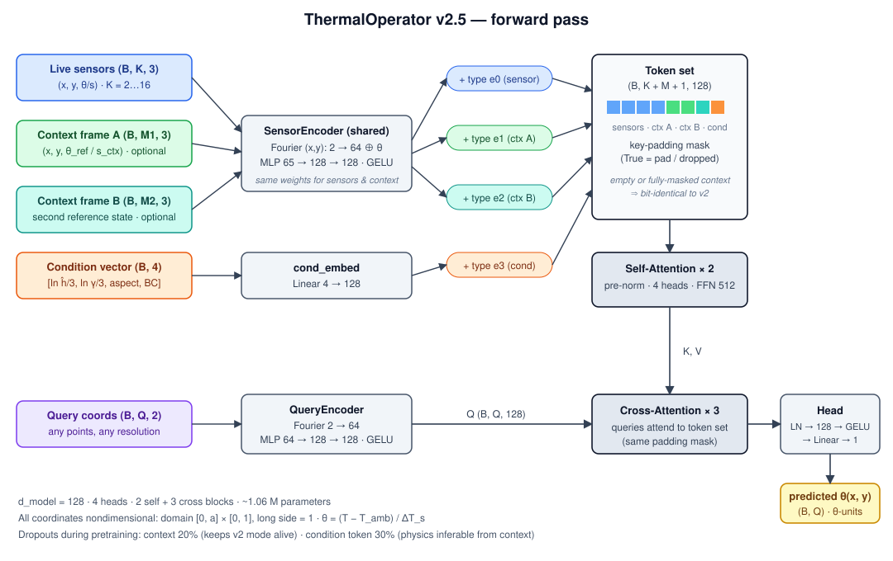
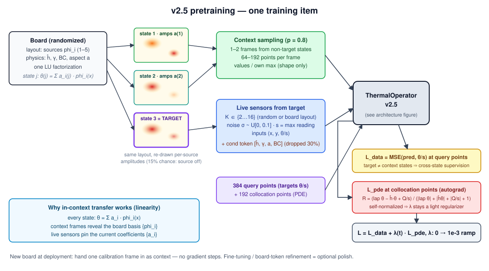

# Board-Transfer Architecture (v2.5) — in-context board conditioning

> **Status: implemented & validated.** Full pretrain (2026-07-10): val RMSE
> 0.077 ctx vs 0.143 no-ctx; **cross-state matched-K context gain 42–52% at
> every K** — the fingerprint mechanism works. Real board: zero-shot 3.3–3.5 °C
> trusted RMSE (RBF 4.0–5.7); Tier-1 board card (1026 params, 5.8 KB) → 3.08 °C
> on the untouched full load and **3.18 °C cross-session**. λ=0 twin ablation:
> physics acts via the data distribution + contract; the residual term buys
> low-information robustness (hotspot 4 vs 34 px no-ctx). InfoNCE auxiliary and
> Q̂-decoder head remain optional follow-ups.

Problem: in v2, "which board this is" lives only in fine-tuned weights. Every new
board ⇒ its own gradient run, own checkpoint, forgetting risk, no explicit board
representation. Goal: the board becomes something the model *reads at inference*,
so transfer = handing over a cheap observation, not retraining.

## Requirements for a board representation

1. **Task-sufficient** — carries what field prediction needs (source layout,
   effective ĥ/γ, geometry), not merely what discriminates boards.
2. **Spatially structured** — the essential board property is a *layout*; a
   single global vector is an information bottleneck.
3. **Obtainable at deployment** — from one calibration frame (or a stored
   "board card"), no gradient steps required.
4. **Swappable** — one shared backbone, per-board context/token, no forgetting.

## Design space (assessed)

| Option | Idea | Verdict |
|---|---|---|
| **A. In-context set conditioning** | reference frame(s) of the board enter as extra attention tokens; model learns to read the board's response structure from them | **recommended core** — smallest delta to our attention operator, preserves spatial structure, zero-gradient transfer; neural-process / in-context-operator family; IPTR (arXiv:2512.01196) validates the reference-pair mechanism on TFR specifically |
| B. Global embedding via contrastive encoder (user's proposal) | CNN encodes an observation → z; InfoNCE pulls same-board views together | right *concept* (explicit representation) but wrong *primary signal*: contrastive learns discrimination, not task-sufficiency, and a single z bottlenecks layout information. Kept as **auxiliary loss** on the pooled board token (clean identity space, t-SNE figure) |
| C. Explicit latent source map | infer Q̂(x,y) then render θ via physics (θ = G_ĥ ∗ Q̂) | physically beautiful but an ill-posed inverse + bigger redesign. Kept as an **interpretability head**: small decoder from board tokens → Q̂, trained on synthetic truth — shows *what* the embedding encodes |
| D. PEFT board tokens (FiLM/LoRA-style) | freeze backbone; per-board learn only a small token/adapter | **promoted to the primary M7 path (2026-07-11, user decision)**: ~8 learnable tokens (~1k params) via the context-token interface, warm-started from encoded real context; full fine-tune demoted to the M8 upper-bound ablation. See `training_protocol.md` §4.3 |

## Why in-context works here (physics, not hope)

The steady PDE is linear: any operating state's field is θ(x) = Σᵢ aᵢ·φᵢ(x),
where φᵢ are the board's fixed per-source unit responses (set by layout, ĥ, BC)
and aᵢ the current source powers. A context frame reveals the *basis* {φᵢ}
(the board); the K live sensors pin the *coefficients* {aᵢ} (the state).
In-context conditioning asks the network to perform exactly this decomposition.
Corollaries that shape the design:
- one context state cannot disentangle sources that never vary independently →
  train with **independent per-source amplitude draws** and prefer **2 context
  frames from different states** (maps 1:1 to our real data: idle + half-load
  context, full-load target — the severity test becomes a pure in-context task);
- ĥ/γ are inferable from context → the oracle condition token becomes optional
  (dropped stochastically in training; kept for synthetic diagnostics).

## Architecture delta (v2 → v2.5)

The forward-pass figure above shows the full token flow (shapes and layer sizes
match `src/tdp/model/operator.py` exactly). Deltas relative to v2:

- ContextEncoder = the existing SensorEncoder + a learned **type embedding**
  (live-sensor vs context-point vs cond-token). No new mechanism.
- Context = M ≈ 64–256 points subsampled from reference field(s) (positions +
  θ_ref normalized by the *context frame's own* ΔT_s; a second type slot marks
  which context state a point came from).
- **Context dropout 20%** → no-context mode stays functional (backward
  compatible with all v2 evaluation).
- **Pooled board token** (mean over context tokens after self-attention) exposed
  as the board embedding: t-SNE figure, InfoNCE auxiliary (same synthetic board
  ↔ close), optional Q̂-decoder head.

## Training changes

- Scenario generator: a *board* = layout + physics; sample **S = 2–4 states**
  per board by re-drawing per-source amplitudes (occasionally switching sources
  off — mimics workload changes). Cost: reuses the same LU factorization per
  board → cheaper per state than v2 per scenario.
- Each training item: pick states (A[, B]) as context, state C as target
  (sometimes C = A: reconstruction of the context state itself from few sensors);
  K sometimes tiny (2–3) so context is *necessary*, sometimes large.
- Losses unchanged (data MSE + self-normalized PDE residual) + optional small
  InfoNCE on pooled tokens + optional Q̂-decoder MSE (synthetic only).

## Evaluation additions

1. Context vs no-context RMSE on held-out synthetic boards (the mechanism works?).
2. Cross-board zero-shot: unseen layout + 1 context frame, no gradients.
3. Real board: context = session-1 idle+half canonical fields (trusted pixels),
   live sensors from full load → severity test *without any fine-tuning*;
   compare against the fine-tuned v2 path.
4. Board-embedding t-SNE across synthetic boards (+ our board(s)).
5. If a second physical board is measured: the headline transfer figure —
   error vs (nothing | context frame | context + token refinement).

## Cost / risk

| Item | Assessment |
|---|---|
| Code delta | small: generator states, type embeddings, context sampling, collate |
| Pretrain cost | similar epochs; states share LU → data gen slightly cheaper |
| Risk: model ignores context | mitigated by tiny-K samples + context dropout; measured by eval #1 |
| Risk: overclaiming | transfer claims stay synthetic-validated unless a second board is measured (optional wishlist item) |
| Timing | **now is the cheap moment** — the full Colab pretrain has not run yet; retrofitting after would mean retraining |

## Migration

v2.5 with empty context ≡ v2 (same losses, same eval) → all existing gates
(M5/M6/M7) remain valid; in-context results enter as additional columns, and the
fine-tune path (M7) remains as the "polish" upper bound.
