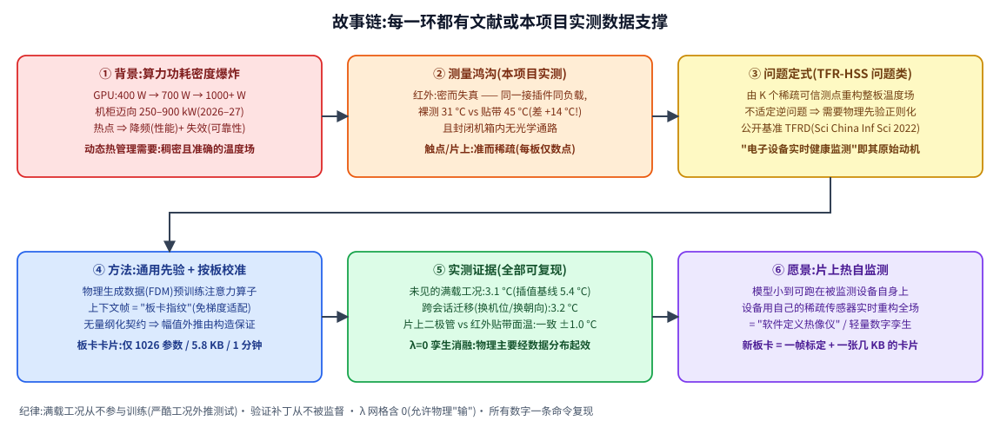

# 基于稀疏可信测点与物理约束的芯片温度场重构——面向片上热自监测

> 竞赛叙事主文档(结果版,2026-07-11)。所有数字来自本仓库实测/训练产物,均可由 `scripts/` 一条命令复现;图表路径指向仓库内文件。

## 摘要

芯片/板卡热管理需要**稠密且准确**的温度场,但两类测量手段各缺一半:红外热像稠密却受发射率系统性欺骗(我们实测:同一接插件同负载,裸测 31 °C、贴黑胶带后 45 °C,**+14 °C 纯属发射率假象**),且封闭机箱内无光学通路;接触式/片上传感器准确却稀疏。我们训练了一个**物理数据预训练的上下文注意力算子**(1.06 M 参数):以有限差分求解的无量纲热传导方程场景做域随机化预训练,参考帧作为"板卡指纹"以上下文形式输入,再用**仅 1026 个参数、5.8 KB 的"板卡卡片"**完成按板校准(骨干全程冻结,约 1 分钟)。在**从未参与训练的满载工况**上:重构可信区 RMSE **3.08 °C**(经典插值 5.39 °C);**跨会话**(重新摆机、旋转 180°、分辨率改变)仍达 **3.18 °C**。片上二极管与红外贴带面温两台独立仪器一致于 **±1.0 °C**,打破了"同一台相机既监督又验证"的循环论证。

## 1. 背景与问题(每一环可引证)

1. **算力功耗密度爆炸**:GPU 单芯片 400 W(2022)→ 700 W(2023)→ 1000–1200 W;机柜迈向 250–900 kW(2026–27 业界预测)。热点直接驱动降频(性能损失)与失效(电迁移、焊点疲劳)。我们的被测板即是缩影:满载 20 分钟,SoC 结温 82.7 °C,**36% 的稳态时间处于 80 °C 软降频阈值之上**——芯片在实测中就是在"自我调节"中运行的。
2. **测量鸿沟(本项目直接实测)**:
   - 红外:**密而失真**。PCB 表面发射率横跨 ~0.05(金属屏蔽罩)到 ~0.95(阻焊/胶带)。第一次实验(接插件裸露)中,USB/以太网屏蔽罩在 55 °C 的板面上"显示"约 31 °C;第二次实验把所有屏蔽罩贴带后,同类负载下同一区域读数 45 °C。**+14 °C 的差异纯由 ε 造成**——这就是不能直接拿红外当真值的证据。此外部署场景(封闭机箱)根本没有光学通路。
   - 接触式/片上:**准而稀疏**。片上温度传感器因面积/成本每板仅数个。
3. **问题定式**:由 K 个稀疏可信测点重构整板温度场——文献中的 **TFR-HSS** 问题类(公开基准 TFRD,*Sci China Inf Sci* 2022,其动机原文即"电子设备实时健康监测");不适定逆问题,需物理先验正则化。

## 2. 方法

### 2.1 无量纲化契约(sim-to-real 的关键)
过余温度 θ = (T − T_amb)/ΔT_s(ΔT_s 取测点最大过余温度,推理时仅凭输入可得);坐标以板长边归一;稳态方程坍缩为 ∇̃²θ − ĥθ + Q̂ = 0,唯一物理参数 **ĥ = hL²/(k_eff·d)**。线性 + 齐次边界 ⇒ **幅值("更严酷工况")外推由构造保证**;跨机位/跨分辨率由坐标归一吸收(实测成立,见 §4)。

### 2.2 网络与"板卡指纹"(v2.5)
传感器集合(K 可变)与查询坐标经傅里叶特征 + 自/交叉注意力;**参考帧的子采样点以"上下文 token"进入注意力集合**——线性物理下任意工况场 θ = Σᵢ aᵢφᵢ(x):上下文揭示板卡的响应基 {φᵢ},在线测点钉定当前系数 {aᵢ}。预训练时每块合成板生成多个工况,跨工况监督迫使模型学会"读指纹"。架构图:`assets/operator_v25.svg`;训练方案:`assets/training_scheme_v25.svg`。

### 2.3 域随机化预训练 → 板卡卡片
- 预训练(Colab GPU,4096 板 × 3 工况):ĥ ∈ log-U[0.3, 30](**范围由实测界定**)、随机纵横比/边界条件/热源;传感器课程 + 实测噪声水平;数据损失 + 自归一化 PDE 残差(λ→1e-3)。结果:上下文使各 K 下 RMSE 降低 **42–52%**(跨工况、同 K 公平比较)。
- 按板校准 = **板卡卡片**:骨干冻结,仅优化 8 个板卡 token + log ĥ + log γ(共 **1026 参数**),以贴带区为核心监督(可信掩膜 + 1/σ² 加权),**验证补丁(12 处,分层于温度范围)从不被监督、从不作输入**,驱动 λ 选择与早停。约 1 分钟收敛,产物 5.8 KB。

## 3. 实验与实测物理量

**装置**:Raspberry Pi 4B(85×56 mm,无散热器),HIKMICRO 红外(192×256,~6 s/帧,ε 设 0.93,0.1 m);黑胶带(ε≈0.95)整片覆盖 SoC/RAM/PMIC 区,第二次实验并包裹全部接插件屏蔽罩;满载 = 4×`yes` 忙循环,`killall` 停止;片上二极管 2 s 采样。两次会话共 **832 帧、12 工况**,逐帧与相机自带统计块交叉校验全部通过。

| 实测物理量 | 结果 | 备注 |
|---|---|---|
| 满载热点(贴带面温,可信) | 79.2 °C(12.5 min)/ **82.0 °C**(20 min 真平台,n_eff=17) | 结温 82.7 °C |
| 软降频 | **36% 稳态时间 ≥ 80 °C** | 满载工况 = 芯片自我调节状态 |
| 二仪一致性 | 结温 − 贴带面温 = **−1.0 °C** | 已知胶带偏差 +0.7~0.9 °C 可解释大半 |
| 冷却模型 | θ(t) = **θ∞ + A·e^(−t/τ)**,R²≈0.999;θ∞≈13 °C | 板停载后仍通电 ⇒ 渐近线是待机平衡而非环境!早期零渐近拟合(τ=411/565 s)属模型失配,已作废 |
| 热时间常数 | 双模态:快模 ~140 s(封装),慢尾 ~251 s(PCB) | 窗口依赖性即证据 |
| ĥ 实测 | **上界 ≲ 3**(全板暖穹顶,无远场) | 界定预训练范围;卡片拟合 ĥ=0.99 与之一致 |
| 发射率实证(屏蔽罩 A/B) | 裸 31 °C vs 贴带 45 °C(同负载) | **+14 °C 纯 ε 假象** |
| 重复性 | 逐像素 σ 0.07–0.43 °C | 作监督权重与噪声增广 |

## 4. 结果(评估纪律:满载从不训练;补丁从不监督;λ 网格含 0)

| 评估 | 本方法 | 经典插值(RBF) |
|---|---|---|
| 零样本(免训练,8 真实点位+1 参考帧),可信区 RMSE | 3.3–3.5 °C | 4.0–5.7 °C |
| 板卡卡片后,验证补丁 RMSE | 2.27 → **1.57 °C(−31%)** | 5.6 °C |
| **未见满载 case02**(第一会话)可信区 | **3.08 °C**,热点定位 4.5 px,max-T −3.1 °C | 5.39 °C,6.1 px |
| **跨会话满载 case06**(重摆机、转 180°、改分辨率) | **3.18 °C** | 5.38 °C |

**λ=0 孪生消融(同种子同数据)**:合成域内基本持平;真实零样本上 PDE 版在 4 组设定中胜 3 组,信息最稀缺时优势最大(无上下文热点定位 **4 px vs 34 px**);卡片校准后两者在测试噪声范围内不可分。**结论:物理主要经"物理生成的数据分布 + 无量纲契约"起效,残差项的价值是稀疏信息下的鲁棒性余量**——这是我们主动运行、如实报告的对照实验。

图:`reports/qc/finetune_tier1_pi4b_s1.png`(重构 vs 实测)、`reports/qc/zeroshot_*.png`、`reports/qc/soc_log_alignment.png`(二极管对齐)、`reports/qc/physics_*.png`(物理提取)。

## 5. 诚实性与不确定度

单板卡、两次会话;测试集有效样本小(稳态帧近重复);验证补丁本质仍是同机红外读数——但片上二极管(独立仪器)与贴带面温 ±1.0 °C 的一致性,以及 +14 °C 屏蔽罩 A/B,为"贴带=可信"提供了独立支撑;峰值仍低估 ~3 °C(谱偏置;部署上可用"不低于传感器自身读数"的保底规则);λ=0 时 ĥ 主要由先验约束(弱可辨识),表述为"与实测上界一致"而非"验证"。

## 6. 愿景与展望

模型 + 卡片小到可在被监测设备上运行:设备读自己的片上传感器,实时重构自身全场温度并挂接告警/降频策略——"软件定义热像仪"。新板卡的接入成本 = 一帧标定 + 一分钟优化 + 一张几 KB 的卡片(M9 将在被测 Pi 上实机演示延迟与自监测闭环)。

## 参考文献锚点

TFR-HSS/TFRD:Chen et al., *Sci China Inf Sci* 2022 (arXiv:2108.08298) · IPTR (arXiv:2512.01196) · 商用 CPU 全片温度图估计(GAN/Intel i7 ~1.3 °C;CNN 4 传感器 ~1 °C)· PINN 传热综述 (*ASME JHT* 143(6):060801) · TL-PINN 仿真预训练+红外微调 · 黑胶带 ε≈0.95 标定实践 · AI 数据中心功率密度轨迹(2026–27 行业预测)。
